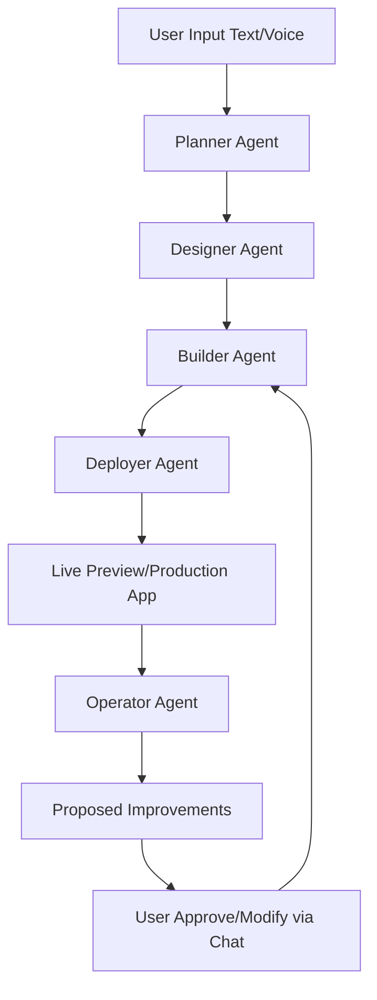

# Production MVP Architecture Blueprint

This blueprint turns the product thesis into an implementation-ready plan.

## 1) Product Definition

**AI SaaS Builder + Operator**

- Builds a SaaS app from an idea
- Deploys it with working infrastructure
- Continuously improves it from usage and reliability data

## 2) Monorepo Layout

```text
ai-platform/
├── backend/           # FastAPI orchestrator API + job control
├── agents/            # planner, builder, deployer, operator
├── templates/         # reusable app blueprints
├── generated_apps/    # generated source output
├── deployer/          # provider adapters + deployment pipelines
├── operator/          # analytics ingestion + experiment engine
└── frontend/          # control panel/dashboard
```

## 3) End-to-End Flow

### User Input

```json
{
  "idea": "Trading dashboard with broker sync and analytics",
  "features": ["auth", "charts", "trade history", "alerts"]
}
```

### Stage A — Planner Agent

Transforms free-form intent into strict JSON spec:

- app_name
- pages
- schema
- integrations
- acceptance checks

### Stage B — Builder Agent

Builds from templates (not scratch):

- Backend: FastAPI
- Frontend: Next.js
- DB: PostgreSQL
- Generates migrations, API routes, and page modules

### Stage C — Deploy Agent

- Provisions database (Supabase or Neon)
- Configures secrets and runtime env vars
- Deploys backend + frontend
- Returns URLs and operational metadata

### Stage D — Operator Agent

Runs daily/weekly loop:

- Pulls analytics + error telemetry
- Detects drop-offs and reliability issues
- Proposes prioritized experiments
- Optionally opens implementation PRs

## 4) Agent Contracts

All agents should use strict structured outputs (JSON schema validated).

### Planner Output Contract (example)

```json
{
  "app_name": "TradeTrack Pro",
  "pages": ["login", "dashboard", "analytics"],
  "database": {
    "users": ["id", "email", "password_hash"],
    "trades": ["id", "symbol", "entry", "exit", "profit"]
  },
  "apis": ["broker_sync"]
}
```

### Operational Rules

- every stage writes artifacts to disk
- every artifact is versioned in git
- every release is gated by checks (typecheck/lint/tests)

## 5) Template-First Strategy

Do not generate full apps from scratch.

```text
templates/
└── saas-dashboard/
    ├── backend/
    ├── frontend/
    └── schema.sql
```

Generation approach:

1. Clone baseline template
2. Apply planner-derived patches
3. Regenerate route/schema/UI registry
4. Run verification checks

## 6) Deployment Architecture

### Starter provider stack (simple + reliable)

- Backend: Railway or Render
- Frontend: Vercel
- Database: Supabase or Neon

### Deployment outputs

- app URLs
- deployment IDs
- environment map
- rollback reference

## 7) Operator Data Model

Track product behavior in `analytics_events`:

- tenant_id
- user_id
- event_name
- event_properties (JSON)
- created_at

Core tracked event families:

- auth lifecycle
- feature usage
- billing lifecycle
- errors/failures
- funnel transitions

## 8) MVP Timeline

### Week 1

- Planner agent
- Template injection builder
- Generate simple app
- Manual deploy path

### Week 2

- Automatic deploy pipeline
- Auth + DB provisioning
- Basic release checks

### Week 3

- Operator ingestion pipeline
- Weekly recommendation report
- PR generation for low-risk improvements

## 9) Guardrails for Production-Style MVP

- schema validation for all agent outputs
- idempotent deploy operations
- secret storage outside generated code
- backup + restore drill before production default
- human approval required for production changes

## 10) What This Gets Right

This plan is strong because it is:

- focused on outcomes after deployment
- template-first (stable and faster)
- compatible with real developer workflows
- extendable to additional verticals later


## 11) Backend Framework Decision Guide

Backend frameworks provide a structured foundation for server-side APIs, data access, and business logic. For this platform, choose one primary framework and keep generated templates consistent.

### Top backend frameworks by language

- **Python**: Django (secure/full-featured), Flask (micro/lightweight), FastAPI (high performance/typed APIs)
- **JavaScript/Node.js**: Express.js (simple/popular), NestJS (modular/enterprise), Koa.js (minimal core)
- **Java**: Spring Boot (robust/enterprise standard)
- **PHP**: Laravel (developer-friendly/full-featured), CodeIgniter (lightweight)
- **Ruby**: Ruby on Rails (rapid product development)
- **C#/.NET**: ASP.NET Core (high performance/cross-platform)
- **Other**: Phoenix (Elixir, concurrent systems), Go (net/http and ecosystem frameworks)

### Selection factors

- **Project requirements**: complexity, multi-tenant needs, real-time features, scale targets
- **Team language comfort**: prefer technologies your team can debug and maintain quickly
- **Community/support**: docs quality, package maturity, and hiring market
- **Performance profile**: latency, throughput, and cost under expected load

### Recommended default for this MVP

- **Primary backend framework**: FastAPI
- **Why**:
  - strong typed contracts for agent-to-service boundaries
  - fast iteration for API-heavy generated SaaS apps
  - simple async support for orchestration and webhooks

If your team is deeply Node-first, use **NestJS** as the secondary default while preserving the same agent contracts.


## 12) Working Backend Foundation (Additive Checklist)

The following foundation can be implemented immediately in Windsurf as the initial backend skeleton.

### Target project structure

```text
ai-platform/
├── backend/
│   ├── main.py
│   ├── config.py
│   ├── routes/
│   │   └── app_routes.py
│   ├── agents/
│   │   ├── planner.py
│   │   ├── builder.py
│   │   ├── operator.py
│   │   └── deployer.py
│   ├── services/
│   │   └── orchestrator.py
│   └── models/
│       └── schemas.py
├── templates/
│   └── saas-dashboard/
└── generated_apps/
```

### Base dependencies

```bash
pip install fastapi uvicorn openai python-dotenv
```

### Backend skeleton modules

- `config.py`: env loading, OpenAI key, model configuration
- `main.py`: FastAPI app bootstrapping + route registration
- `models/schemas.py`: request/response contracts (`AppRequest`, `AppResponse`)
- `services/orchestrator.py`: planner → builder → deployer pipeline
- `agents/planner.py`: transforms idea to structured spec
- `agents/builder.py`: initial scaffold creation from spec
- `agents/deployer.py`: deploy stub returning URL metadata
- `agents/operator.py`: improvement recommendation stub
- `routes/app_routes.py`: `/build-app` endpoint for orchestration

### Runtime flow

1. Receive POST `/build-app`
2. Run planner to produce product spec
3. Run builder to produce generated app files
4. Run deployer to publish and return URL
5. Return pipeline result payload to caller

### Suggested API smoke test payload

```json
{
  "idea": "A SaaS dashboard to track trading performance",
  "features": ["auth", "charts"]
}
```

## 13) Builder Upgrade: Template Engine + Premium UI Path

This is the required upgrade from file-generation to production-style app composition.

### Core architecture shift

```text
Builder Agent
   ↓
Template Engine
   ↓
UI Generator (Design Layer)
   ↓
Feature Injector
   ↓
Code Assembler
```

### Expanded template layout

```text
templates/
└── saas-pro/
    ├── frontend/   # Next.js + Tailwind + shadcn/ui
    ├── backend/    # FastAPI or Node
    ├── db/
    │   └── schema.sql
    ├── features/
    │   ├── auth/
    │   ├── billing/
    │   ├── dashboard/
    │   └── analytics/
```

### Premium UI stack targets

- Next.js 14
- Tailwind CSS
- shadcn/ui
- Lucide icons

### Design system generation stage

Add `agents/design_generator.py` that creates JSON design output:

- color palette
- typography
- layout style
- component style
- visual inspiration references

### Feature injection strategy

- copy feature packs from template to generated app
- include only requested features from planner spec
- keep feature modules isolated for easier maintenance

### Upgraded builder behavior

The builder should now:

1. copy base template (`saas-pro`)
2. generate design JSON
3. apply design config to frontend
4. inject requested features
5. return app path + included features

### UI polish phase (post-build)

Add optional `ui_polish` step to improve:

- spacing
- typography hierarchy
- responsiveness
- modern SaaS interaction patterns

### Minimum baked-in quality features

- auth
- Stripe subscriptions
- dashboard layout
- charts (Recharts)
- settings page
- API layer

### Expected user-facing output

After `/build-app` completes, users should receive:

- live app URL
- modern UI baseline
- auth-ready experience
- billing-ready integration surface
- working dashboard foundation

### Next implementation upgrades

- replace deploy stub with Vercel + Supabase/Neon provisioning
- add Stripe integration workflow
- persist analytics for operator recommendations
- enable operator-generated code PRs for low-risk changes

## 14) Settings Information Architecture (Additive, Non-Destructive)

Keep all existing settings and add any missing sections from the following canonical map.

### Workspace settings

- basic_information
- plan_and_billing
- credit_usage
- members
- auth_and_security
- integrations
- skills
- apps_configuration

### Integrations settings

- connectors

### Account settings

- account_settings
- mcp_connections

### Implementation notes

- all settings groups are tenant-scoped except account-level settings
- settings should be editable via both UI and API
- audit log entries should be recorded for sensitive settings changes

## 15) Conversational Build Loop (Describe → Build → Text-to-Edit)

The platform must support natural-language creation and modification as first-class behavior.

### Required user experience

1. user describes desired app in plain language
2. planner generates structured spec automatically
3. builder/deployer execute without requiring manual technical setup
4. user sends follow-up text changes ("change this", "add X", "remove Y")
5. system computes diff plan, applies changes, and redeploys preview

### Minimal API surface (example)

- `POST /projects/{id}/describe` → creates/updates project intent
- `POST /projects/{id}/build` → runs planner/builder/deployer pipeline
- `POST /projects/{id}/changes` → applies natural-language change request
- `GET /projects/{id}/runs` → run history and status
- `GET /projects/{id}/artifacts` → generated specs, code, and deployment outputs

### Change management guarantees

- every text change request is versioned
- generated update plan is shown before apply (or auto-applied by policy)
- failures are recoverable through rollback + previous artifact restore

## 16) Tech Architecture Update: Settings Manager Module (Additive)

Add a settings module without removing existing backend structure.

### Updated backend layout

```text
backend/
 ├── main.py
 ├── config.py
 ├── routes/
 │    └── app_routes.py
 ├── agents/
 │    ├── planner.py
 │    ├── builder.py
 │    ├── operator.py
 │    └── deployer.py
 ├── services/
 │    └── orchestrator.py
 ├── models/
 │    └── schemas.py
 └── settings/
      └── settings_manager.py
```

### `settings_manager.py` simplified behavior

```python
class SettingsManager:
    def __init__(self, current_settings: dict):
        # keep existing settings
        self.settings = current_settings

    def add_settings(self, new_settings: dict):
        # only add missing keys
        for k, v in new_settings.items():
            if k not in self.settings:
                self.settings[k] = v

    def get_settings(self):
        return self.settings
```

### Usage example

```python
current = {
    "Workspace": {},
    "Basic information": {},
    "Plan and billing": {},
    "Members": {},
    "Auth and security": {},
}

new = {
    "Connectors": {},
    "Account": {},
    "MCP connections": {},
}

sm = SettingsManager(current)
sm.add_settings(new)
final_settings = sm.get_settings()
```

## 17) Full Conversational Lifecycle (Text → Build → Modify)

- user sends text description
- planner agent generates spec + design direction
- builder agent assembles app from templates
- deployer agent publishes preview/live environment
- operator agent monitors behavior and applies text-driven updates

### Governance requirements

- detect change category automatically (UI, data model, feature, workflow)
- apply changes through safe rollout policy
- provide before/after diffs for user review
- preserve rollback points for every applied change

## 18) Atoms/Base44/Manus Parity Blueprint (Additive)

### Agent chain and responsibilities

- **Planner / PM agent**: converts idea to structured spec, pages, and data model
- **Designer / UX agent**: generates luxury-grade design system and UX patterns
- **Builder / Engineer agent**: assembles full-stack app from templates + feature modules
- **Deployer / Ops agent**: provisions infra and publishes preview/live environments
- **Operator / Growth agent**: monitors usage/errors and applies approved improvements

### System flow diagram



### UX contract (must-have)

- users can start by describing what they want in plain language
- users can request changes by text/voice at any step
- system returns clear "what changed" summaries and before/after diffs
- production updates require policy-based approvals
- rollback is available for every deployment/update

## 19) v1 Technical Stack Profile (Additive)

### Backend/orchestration

- FastAPI (Python)
- orchestrator service for Planner → Designer → Builder → Deployer → Operator

### Frontend generation target

- Next.js 14
- Tailwind CSS
- shadcn/ui
- Lucide icons

### Data/auth/billing

- Supabase or Postgres-compatible database
- JWT or provider auth integration
- Stripe subscriptions

### Model routing suggestion (v1)

- Planner/Designer: GPT-5-mini for fast structured generation
- Builder/Operator: model selected by complexity policy (default fast model, escalate for harder edits)

### Experience layer

- text chat required
- voice-to-text optional but supported
- real-time preview links and branch-based environments
